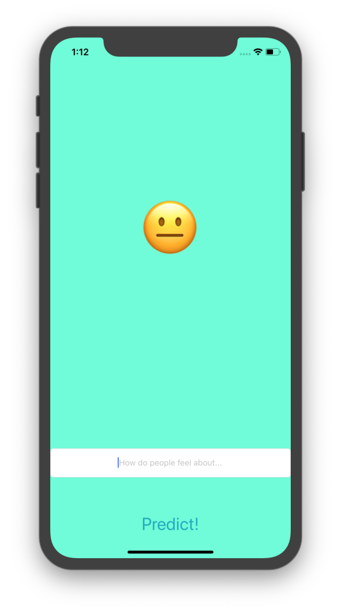

# Twitter Sentiment Classifier

## Screenshots

  
  

## Overview

Twitter Sentiment Classifier is an app built using Swift and CoreML! A app fetches latest 100 tweets from twitter for a particular keyword provided by the user and displays the result depending upon the tweets submitted by people all around the globe. The app incorporates:

- Swift
- CoreML
- SwiftyJSON
- SwifteriOS

## Getting Started

> This app is not available on the App Store.

### Prerequisites

- A Mac running macOS
- Xcode

### Installation

1. Clone or download the project to your local machine
2. Open the project in Xcode
3. Run the simulator
